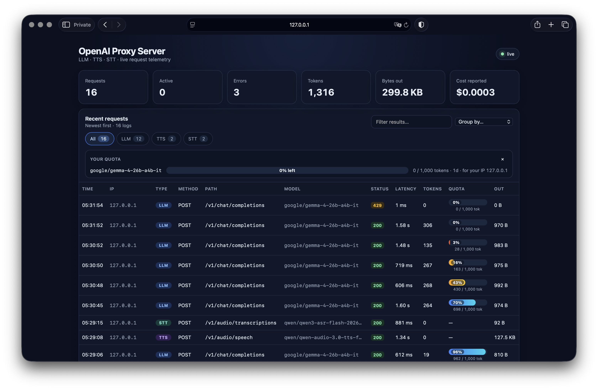

# openai-proxy-server

A small OpenAI-compatible reverse proxy for **LLM + TTS + STT**. Point an OpenAI-compatible client at:

```text
http://localhost:56787/v1
```

The proxy selects the upstream for ordinary OpenAI requests, text-to-speech, and speech-to-text; injects configured defaults; preserves streaming responses; and exposes a tiny real-time dashboard with request logs and usage counters.

## Features

- Generic reverse proxy for `/v1/*` — not limited to a hard-coded endpoint list.
- Separate upstream URL / API key / model for LLM, TTS, and STT.
- `POST /v1/audio/speech` routes through the TTS config.
- `POST /v1/audio/transcriptions` and `/v1/audio/translations` route through the STT config.
- SSE/chunked streaming is forwarded immediately, without buffering the whole response.
- Binary audio is streamed unchanged.
- Multipart uploads (for standard OpenAI STT clients) are streamed unchanged.
- HTTP WebSocket upgrades are tunneled for realtime-style endpoints.
- Optional local API key (`PROXY_API_KEY`).
- Live dashboard and SSE telemetry at `/_proxy/`.
- Persistent aggregate stats + recent logs in `.openai-proxy-server/stats.json` by default.
- No prompt/audio contents are written to the request log; only metadata/usage is retained.

## Quick start

Create `.env` in the directory where you run the command:

```dotenv
OPENAI_BASE_URL=https://openrouter.ai/api/v1
OPENAI_API_KEY=sk-or-v1-
OPENAI_MODEL=google/gemma-4-26b-a4b-it

TTS_BASE_URL=https://openrouter.ai/api/v1
TTS_API_KEY=sk-or-v1-
TTS_MODEL=qwen/qwen-audio-3.0-tts-flash
TTS_VOICE=longanhuan_v3.6

STT_BASE_URL=https://openrouter.ai/api/v1
STT_API_KEY=sk-or-v1-
STT_MODEL=qwen/qwen3-asr-flash-2026-02-10
```

Then run:

```bash
npx openai-proxy-server
```

Expected endpoints:

```text
OpenAI base URL: http://localhost:56787/v1
Dashboard:       http://localhost:56787/_proxy/
```

By default the server binds `0.0.0.0`, so it is also reachable from any device on the same network. The startup banner prints the exact network URL(s), for example:

```text
[openai-proxy-server] LAN API:       http://192.168.1.23:56787/v1
[openai-proxy-server] LAN Dashboard: http://192.168.1.23:56787/_proxy/
```

Replace `192.168.1.23` with the LAN IP printed when you start it. Opening the bare host (`http://host:port/`) redirects to the dashboard.

For local source checkout:

```bash
npm install
npm start
```

## LLM example

```bash
curl http://localhost:56787/v1/chat/completions \
  -H "Content-Type: application/json" \
  -H "Authorization: Bearer local-anything" \
  -d '{
    "messages": [{"role":"user","content":"How many r`s are in strawberry?"}],
    "reasoning": {"enabled": true},
    "stream": true
  }'
```

If `model` is omitted from a JSON request, `OPENAI_MODEL` is inserted when `MODEL_POLICY=default` (the default).

## TTS example

```bash
curl http://localhost:56787/v1/audio/speech \
  -H "Content-Type: application/json" \
  -H "Authorization: Bearer local-anything" \
  --output output.mp3 \
  -d '{
    "input": "Hello! This is a text-to-speech test."
  }'
```

The proxy fills `TTS_MODEL` and `TTS_VOICE` when they are absent.

## STT example: OpenRouter JSON audio input

```bash
AUDIO_BASE64=$(base64 < audio.wav | tr -d '\n')

curl http://localhost:56787/v1/audio/transcriptions \
  -H "Content-Type: application/json" \
  -H "Authorization: Bearer local-anything" \
  -d '{
    "input_audio": {
      "data": "'"$AUDIO_BASE64"'",
      "format": "wav"
    }
  }'
```

`STT_MODEL` is inserted for JSON requests when the request does not include a model.

## OpenAI SDK examples

JavaScript:

```js
import OpenAI from 'openai';

const client = new OpenAI({
  baseURL: 'http://localhost:56787/v1',
  apiKey: 'local-anything'
});

const stream = await client.chat.completions.create({
  model: 'ignored-only-if-MODEL_POLICY=force',
  messages: [{ role: 'user', content: 'Hello' }],
  stream: true
});

for await (const chunk of stream) {
  process.stdout.write(chunk.choices?.[0]?.delta?.content || '');
}
```

Python:

```python
from openai import OpenAI

client = OpenAI(
    base_url="http://localhost:56787/v1",
    api_key="local-anything",
)

response = client.chat.completions.create(
    model="any-model-name",
    messages=[{"role": "user", "content": "Hello"}],
)
print(response.choices[0].message.content)
```

## Routing

| Incoming path | Upstream configuration |
|---|---|
| `/v1/audio/speech` | `TTS_*` |
| `/v1/audio/transcriptions` | `STT_*` |
| `/v1/audio/translations` | `STT_*` |
| everything else under `/v1/*` | `OPENAI_*` |

The local `/v1` prefix is replaced by the path already present in the configured base URL. For example:

```text
local:    http://localhost:56787/v1/chat/completions
upstream: https://openrouter.ai/api/v1/chat/completions
```

Query strings are preserved.

## Model policy

```dotenv
MODEL_POLICY=default
VOICE_POLICY=default
```

Supported values:

- `default`: insert the configured value only when a JSON request omitted it.
- `force`: overwrite the corresponding field in JSON requests.
- `passthrough`: never change it.

Multipart bodies are deliberately streamed as-is. This keeps standard OpenAI file/audio uploads compatible and memory-efficient; their `model` field is therefore not rewritten by `MODEL_POLICY=force`.

## Local API authentication

By default the proxy accepts any client Authorization header (or none) and replaces it with the appropriate upstream API key.

To require a local key:

```dotenv
PROXY_API_KEY=my-local-secret
```

Then clients must send:

```text
Authorization: Bearer my-local-secret
```

The upstream keys are never returned to the client.

## Limits / quotas

You can configure one or more usage quotas in `LIMITS` (JSON array). Each rule optionally matches a model and/or route kind, and counts a metric over a rolling window per IP address (or globally):

```dotenv
# max 2,000,000 tokens per IP for this model over a rolling 7 days
LIMITS=[{"metric":"tokens","scope":"ip","window":"7d","max":2000000,"model":"google/gemma-4-26b-a4b-it"}]
# max 100 requests per IP per hour
LIMITS=[{"metric":"requests","scope":"ip","window":"1h","max":100}]
```

Fields per rule:

- `metric` — `tokens` (counts `usage.total_tokens` from the upstream response) or `requests` (always 1).
- `scope` — `ip` buckets usage per client IP; `all` is one shared bucket.
- `window` — rolling period: `1h`, `24h`, `7d`, `30d`, or a millisecond number.
- `max` — the allowance per window.
- `model` — optional exact model matcher (case-insensitive); omit to match any model.
- `kind` — optional exact matcher: `openai` (LLM), `tts`, `stt`.
- `name` — optional label shown in the dashboard/API.

Behavior:

- Quotas are **soft**: a request is allowed while usage `< max`; once a completed request pushes usage to `max`, later matching requests are rejected with **HTTP 429 `quota_exceeded`** (with the quota details in the JSON body) **before** hitting the upstream, so no tokens are spent.
- Every proxied response includes quota headers for the tightest matching rule: `X-Quota-Used`, `X-Quota-Max`, `X-Quota-Remaining`, `X-Quota-Remaining-Pct`, `X-Quota-Window`, `X-Quota-Metric` (429 responses include them too).
- The dashboard's **Quota** column shows a remaining-percentage bar for each request; the same `quota` object is included in `/api/logs` entries.
- Model matchers apply to JSON requests (the model is known after injection). Rules **without** a `model` matcher also apply to multipart/streamed uploads (matched by route `kind` or applied globally); token counting for those still needs a `usage` object in the response.
- Quota accounting lives in memory (reset on restart), like `stats`; usage without a `usage` object in the response counts 0 tokens.

## Dashboard and stats

Open:

```text
http://localhost:56787/_proxy/
```

The dashboard shows in real time:

- total and active requests;
- errors;
- input/output bytes;
- token usage when the upstream returns a standard `usage` object;
- provider-reported cost when present in `usage.cost`/`usage.total_cost`;
- recent request metadata, client IP, model, status, latency and response size.



Logs can be grouped (top IPs, models, methods, status codes, types, paths, hours) and filtered. Pick a grouping from the "Group by…" menu and click any group to filter; active filters appear as removable chips (with a "Clear all" shortcut). The search box filters across path, model, method, IP, status and errors. "Group by hour" shows the most recent 24 hours.

API endpoints:

```text
GET /_proxy/api/stats
GET /_proxy/api/logs?limit=&offset=&kind=&ip=&model=&method=&status=&path=&hour=&q=
GET /_proxy/api/groups?field=ip|model|method|status|kind|path|hour&limit=&kind=&ip=&model=&method=&status=&path=&hour=&q=
GET /_proxy/api/quota   # current limits + remaining usage for the requesting IP
GET /_proxy/events      # Server-Sent Events
```

`/api/logs` returns `{ total, logs }` (newest first) when any filter or pagination parameter is present, and a plain array otherwise. Filters in `/api/logs` are: `kind`, `ip`, `model`, `method` (exact), `status` (exact), `path` (exact) and `hour` (the UTC hour prefix, e.g. `2026-09-13T03`), plus `q` for free-text search. `/api/groups` returns `{ field, total, groups }` where each group has `key`, `label`, `count`, `totalTokens`, `cost`, `audioSeconds` and `bytesOut`, sorted by descending count (newest first for `hour`).

The dashboard is exposed to your network by default, so set a token to protect it (and `PROXY_API_KEY` to protect the API):

```dotenv
DASHBOARD_TOKEN=dashboard-secret
```

Then open:

```text
http://localhost:56787/_proxy/?token=dashboard-secret
```

Stats persist to:

```dotenv
STATS_FILE=.openai-proxy-server/stats.json
MAX_LOG_ENTRIES=1000
```

## Streaming and usage notes

The proxy never waits for the complete upstream body before forwarding it. SSE, chunked text, and binary audio are streamed immediately.

Usage accounting is exact only when the upstream includes a `usage` object. For streamed chat responses, many OpenAI-compatible servers require the caller to request streaming usage explicitly (for example through `stream_options.include_usage`). This proxy does not silently change that option, so it will not invent token counts when the provider omits them.

## Configuration reference

```dotenv
# 0.0.0.0 binds every interface (reachable from your network);
# 127.0.0.1 restricts to this machine only.
HOST=0.0.0.0
PORT=56787
DASHBOARD=true
DASHBOARD_PATH=/_proxy
PROXY_API_KEY=
DASHBOARD_TOKEN=

OPENAI_BASE_URL=https://openrouter.ai/api/v1
OPENAI_API_KEY=
OPENAI_MODEL=

TTS_BASE_URL=
TTS_API_KEY=
TTS_MODEL=
TTS_VOICE=

STT_BASE_URL=
STT_API_KEY=
STT_MODEL=

MODEL_POLICY=default
VOICE_POLICY=default
MAX_JSON_BODY_MB=50
MAX_STREAM_BODY_MB=512
UPSTREAM_TIMEOUT_MS=0
STATS_FILE=.openai-proxy-server/stats.json
MAX_LOG_ENTRIES=1000
LOG_LEVEL=info
CORS_ORIGIN=*

OPENROUTER_HTTP_REFERER=
OPENROUTER_X_TITLE=
```

`TTS_BASE_URL`/`TTS_API_KEY` and `STT_BASE_URL`/`STT_API_KEY` fall back to the `OPENAI_*` values when omitted.

## Security

The default bind address is `0.0.0.0`, so the proxy is reachable from any device on your network — including the authenticated upstream calls and the dashboard. For anything beyond a trusted home network, set `PROXY_API_KEY` and `DASHBOARD_TOKEN`; otherwise anyone on the network can use your upstream keys through the proxy. Use `HOST=127.0.0.1` to restrict to the local machine. Do not commit `.env`.

The logs intentionally do **not** record request/response bodies, prompts, transcripts, audio, or Authorization headers.

## Development

```bash
npm install
npm test
npm run check
```

## License

MIT
